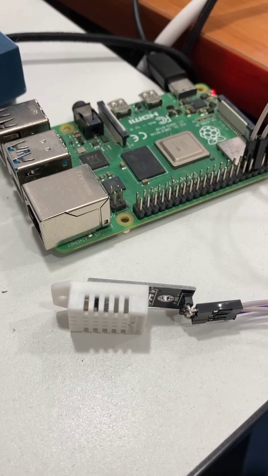
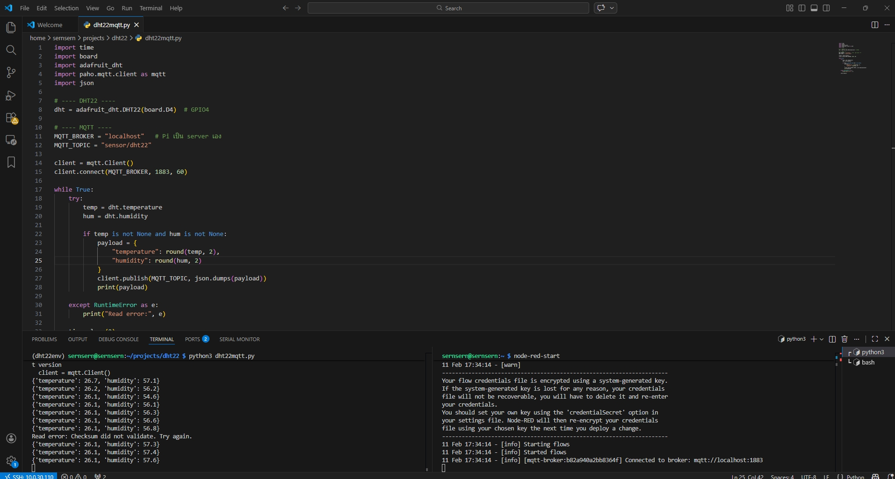
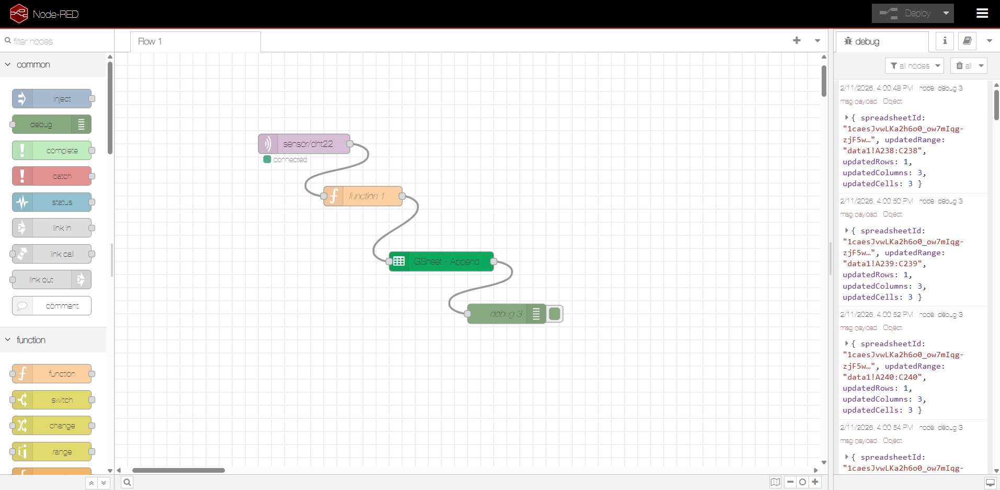
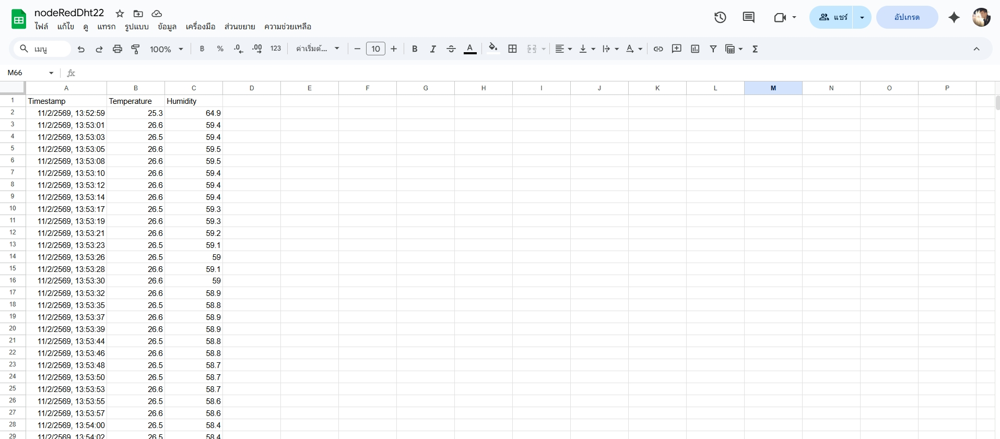
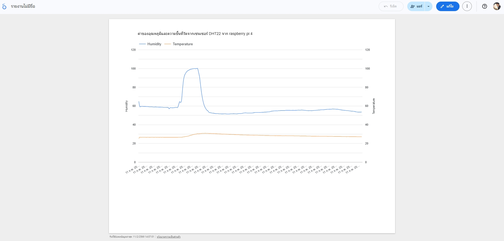
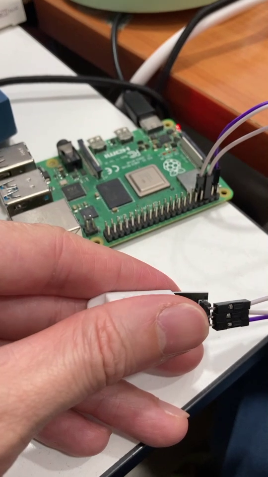

# Real-time-DHT22-Data-Pipeline-Raspberry-Pi-to-Looker-Studio
https://youtu.be/q6JtqDnpzvc

  

ติดตั้งระบบปฏิบัติการ Raspberry Pi OS (64-bit) ลงบน MicroSD Card ผ่านเครื่องมือ Raspberry Pi Imager พร้อมทั้งตั้งค่าการเชื่อมต่อระยะไกลผ่าน SSH เพื่อความสะดวกในการบริหารจัดการระบบแบบ Headless (ไม่ต้องต่อจอภาพ)

Virtual Environment: จัดทำ Python Virtual Environment (venv) เพื่อแยกแยะ Library สำหรับการอ่านค่าเซนเซอร์ ป้องกันความสับสนของ Package ในระบบหลัก (System-wide)

Hardware Wiring & Pinout Mapping
Interface Connectivity: ทำการวิเคราะห์ GPIO Pinout diagram ของ Raspberry Pi 4 เพื่อเชื่อมต่อกับเซนเซอร์ DHT22 ผ่านสายสัญญาณแบบ Digital

Circuit Integration:

VCC (3.3V): ต่อเข้ากับขา Pin 1

Data: ต่อเข้ากับขา GPIO 4 (Pin 7) เพื่อส่งสัญญาณข้อมูลแบบ One-Wire

GND: ต่อเข้ากับขา Pin 9

การเลือกใช้ GPIO 4 ช่วยให้การเขียนโปรแกรมจัดการข้อมูลเป็นมาตรฐานและง่ายต่อการ Debug ผ่าน Library

  

ออกแบบ Workflow บน Node-RED เพื่อรับข้อมูลจาก Raspberry Pi ผ่านโพรโทคอล MQTT โดยมีการใช้โหนด JSON และ Function (JavaScript) เพื่อจัดระเบียบข้อมูล (Data Transformation) ก่อนส่งผ่าน Google Sheets API เข้าสู่ฐานข้อมูลบนคลาวด์แบบอัตโนมัติ

  

  

ข้อมูลเซนเซอร์ที่ถูกบันทึกแบบ Real-time ลงบน Google Sheets

  

Business Intelligence (BI) Dashboard for Monitoring "รายงานข้อมูลเชิงวิเคราะห์ (Dashboard) ผ่าน Google Looker Studio ที่เชื่อมต่อกับฐานข้อมูลโดยตรง
จากข้อมูลในภาพ ได้ทดสอบจับที่เซนเซอร์ DHT22 เพื่อเพิ่มความชื้น ทำให้ค่าข้อ Humidity ขึ้นสูง
หลังจากปล่อยมือค่าค่อยลดลงจนถึงจุดปกติ

  

